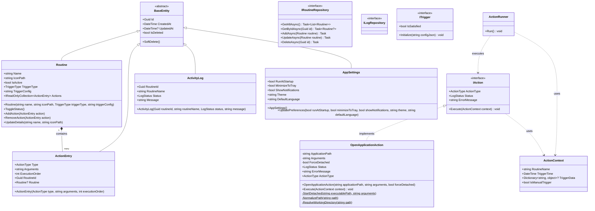

# Code Visualization: SmartRoutines

The following diagram visualizes the structure of the classes, interfaces, and their relationships in the SmartRoutines project.

```mermaid
classDiagram
    %% Base Classes
    class BaseEntity {
        <<abstract>>
        +Guid Id
        +DateTime CreatedAt
        +DateTime? UpdatedAt
        +bool IsDeleted
        +SoftDelete()
    }

    %% Models
    class Routine {
        +string Name
        +string IconPath
        +bool IsActive
        +TriggerType TriggerType
        +string TriggerConfig
        +IReadOnlyCollection~ActionEntry~ Actions
        +Routine(string name, string iconPath, TriggerType triggerType, string triggerConfig)
        +ToggleStatus()
        +AddAction(ActionEntry action)
        +RemoveAction(ActionEntry action)
        +UpdateDetails(string name, string iconPath)
    }

    class ActionEntry {
        +ActionType Type
        +string Arguments
        +int ExecutionOrder
        +Guid RoutineId
        +Routine? Routine
        +ActionEntry(ActionType type, string arguments, int executionOrder)
    }

    class ActivityLog {
        +Guid RoutineId
        +string RoutineName
        +LogStatus Status
        +string Message
        +ActivityLog(Guid routineId, string routineName, LogStatus status, string message)
    }

    class AppSettings {
        +bool RunAtStartup
        +bool MinimizeToTray
        +bool ShowNotifications
        +string Theme
        +string DefaultLanguage
        +AppSettings()
        +UpdatePreferences(bool runAtStartup, bool minimizeToTray, bool showNotifications, string theme, string defaultLanguage)
    }
    
    class ActionContext {
        +string RoutineName
        +DateTime TriggerTime
        +Dictionary~string, object~? TriggerData
        +bool IsManualTrigger
    }

    %% Interfaces
    class IRoutineRepository {
        <<interface>>
        +GetAllAsync() Task~List~Routine~~
        +GetByIdAsync(Guid id) Task~Routine?~
        +AddAsync(Routine routine) Task
        +UpdateAsync(Routine routine) Task
        +DeleteAsync(Guid id) Task
    }

    class ILogRepository {
        <<interface>>
        %% Currently empty in code (Problem)
    }

    class IAction {
        <<interface>>
        +ActionType ActionType
        +LogStatus Status
        +string ErrorMessage
        +Execute(ActionContext context) void
    }

    class ITrigger {
        <<interface>>
        +bool IsSatisfied
        +Initialize(string configJson) void
    }

    %% Logic Classes
    class ActionRunner {
        +Run() void
    }

    class OpenApplicationAction {
        -string ApplicationPath
        -string Arguments
        -bool ForceDetached
        +LogStatus Status
        +string ErrorMessage
        +ActionType ActionType
        +OpenApplicationAction(string applicationPath, string arguments, bool forceDetached)
        +Execute(ActionContext context) void
        -StartDetached(string executablePath, string arguments)$
        -NormalizePath(string path)$
        -ResolveWorkingDirectory(string path)$
    }

    %% Relationships
    BaseEntity <|-- Routine
    BaseEntity <|-- ActionEntry
    BaseEntity <|-- ActivityLog
    BaseEntity <|-- AppSettings

    Routine "1" *-- "many" ActionEntry : contains

    IAction <|.. OpenApplicationAction : implements
    
    ActionRunner ..> IAction : executes
    ActionRunner ..> ActionContext : uses
    IAction ..> ActionContext : uses
```
